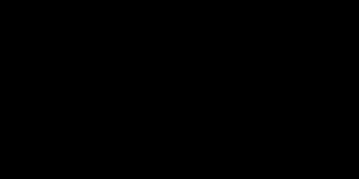

# ContraCLIP: Interpretable GAN generation driven by pairs of contrasting sentences

Authors official PyTorch implementation of the **[ContraCLIP: Interpretable GAN generation driven by pairs of contrasting sentences](https://arxiv.org/pdf/2206.02104.pdf)**. If you use this code for your research, please [**cite**](#citation) our paper.

> **ContraCLIP: Interpretable GAN generation driven by pairs of contrasting sentences**<br>
> Christos Tzelepis, James Oldfield, Georgios Tzimiropoulos, and Ioannis Patras<br>
> https://arxiv.org/abs/2206.02104 <br>
> 
>
> **Abstract**: This work addresses the problem of discovering non-linear interpretable paths in the latent space of pre-trained GANs in a model-agnostic manner. In the proposed method, the discovery is driven by a set of pairs of natural language sentences with contrasting semantics, named semantic dipoles, that serve as the limits of the interpretation that we require by the trainable latent paths to encode. By using the pre-trained CLIP encoder, the sentences are projected into the vision-language space, where they serve as dipoles, and where RBF-based warping functions define a set of non-linear directional paths, one for each semantic dipole, allowing in this way traversals from one semantic pole to the other. By defining an objective that discovers paths in the latent space of GANs that generate changes along the desired paths in the vision-language embedding space, we provide an intuitive way of controlling the underlying generating factors and address some of the limitations of the state-of-the-art works, namely, that a) they are typically tailored to specific GAN architectures (i.e., StyleGAN), b) they disregard the relative position of the manipulated and the original image in the image embedding and the relative position of the image and the text embeddings, and c) they lead to abrupt image manipulations and quickly arrive at regions of low density and, thus, low image quality, providing limited control of the generative factors.


| Semantic Dipole (i.e., contrasting sentences given in natural language) |                           Example                            |
| ------------------------------------------------------------ | :----------------------------------------------------------: |
| *"a picture of a **happy shaved man**." &#8594; "a picture of a **man** with a **beard crying**."* <br>[StyleGAN2@FFHQ] |  |
| *"a picture of a **young person**." &#8594; "a picture of an **old person**."* <br>[StyleGAN2@FFHQ] |  |
| *"a picture of a **man** with **hair**." &#8594; "a picture of a **bald man**."* <br>[ProgGAN@CelebA-HQ] |  |
| *"a picture of a **face without makeup**." &#8594; "a picture of a **face with makeup**."* <br>[ProgGAN@CelebA-HQ] |  |
| *"a picture of an **ugly cat**." &#8594; "a picture of a **cute cat**."* <br>[StyleGAN2@AFHQ-Cats] |  |
| *"a picture of a **dog** with **small eyes**." &#8594; "a picture of a **dog** with **big eyes**."* <br>[StyleGAN2@AFHQ-Dogs] |  |


## Overview


<p alighn="center">
The CLIP text space, warped due to semantic dipoles of contrasting pairs of sentences in natural language, provides supervision to the optimisation of non-linear interpretable paths in the latent space of a pre-trained GAN.
</p>


## Installation

We recommend installing the required packages using python's native virtual environment as follows:

```bash
$ python -m venv contra-clip-venv
$ source contra-clip-venv/bin/activate
(contra-clip-venv) $ pip install --upgrade pip
(contra-clip-venv) $ pip install -r requirements.txt
(contra-clip-venv) $ pip install git+https://github.com/openai/CLIP.git
(contra-clip-venv) $ pip install --pre torch torchvision torchaudio -f https://download.pytorch.org/whl/nightly/cu113/torch_nightly.html
```

For using the aforementioned virtual environment in a Jupyter Notebook, you need to manually add the kernel as follows:

```bash
(contra-clip-venv) $ python -m ipykernel install --user --name=contra-clip-venv
```


## Prerequisite pre-trained models and pre-trained ContraCLIP models

Download the prerequisite pre-trained models (GAN generators and ArcFace), as well as pre-trained ContraCLIP models as follows:

```bash
(contra-clip-venv) $ python download.py
```

This will create a directory `models/pretrained` with the following sub-directories (~7.4 GiB):

```
./models/pretrained/
├── arcface
│   └── model_ir_se50.pth
└── genforce
    ├── pggan_bird256.pth
    ├── pggan_car256.pth
    ├── pggan_celebahq1024.pth
    ├── pggan_church256.pth
    ├── pggan_pottedplant256.pth
    ├── stylegan2_afhqcat512.pth
    ├── stylegan2_afhqdog512.pth
    ├── stylegan2_afhqv2512.pth
    ├── stylegan2_car512.pth
    ├── stylegan2_cat256.pth
    ├── stylegan2_church256.pth
    ├── stylegan2_ffhq1024.pth
    ├── stylegan2_horse256.pth
    ├── stylegan2_metfaces1024.pth
    ├── stylegan_animeface512.pth
    ├── stylegan_animeportrait512.pth
    ├── stylegan_apartment256.pth
    ├── stylegan_artface512.pth
    ├── stylegan_bedroom256.pth
    ├── stylegan_car512.pth
    ├── stylegan_cat256.pth
    ├── stylegan_celebahq1024.pth
    ├── stylegan_ffhq1024.pth
    └── stylegan_tower256.pth
```

as well as, a directory `experiments/complete/` (if not already created by the user upon an experiment's completion) for downloading the ContraCLIP pre-trained models with the following sub-directories (~35 MiB):

```
.experiments/complete/
├── ContraCLIP_pggan_celebahq1024-Z-K11-D128-eps0.1_0.2-nonlinear_beta-0.75-contrastive_0.5-expressions
├── ContraCLIP_pggan_celebahq1024-Z-K9-D128-eps0.1_0.2-nonlinear_beta-0.75-contrastive_0.5-attributes
├── ContraCLIP_stylegan2_afhqcat512-W-K3-D128-eps0.1_0.2-nonlinear_beta-0.75-contrastive_0.5-cats
├── ContraCLIP_stylegan2_afhqdog512-W-K5-D128-eps0.1_0.2-nonlinear_beta-0.75-contrastive_0.5-dogs
├── ContraCLIP_stylegan2_car512-W-K3-D128-eps0.1_0.2-nonlinear_beta-0.75-contrastive_0.5-cars
├── ContraCLIP_stylegan2_ffhq1024-W-K11-D128-eps0.1_0.2-nonlinear_beta-0.75-contrastive_0.5-expressions
├── ContraCLIP_stylegan2_ffhq1024-W-K3-D128-eps0.1_0.2-linear-contrastive_0.5-expressions3
├── ContraCLIP_stylegan2_ffhq1024-W-K3-D128-eps0.1_0.2-nonlinear_beta-0.75-contrastive_0.5-expressions3
├── ContraCLIP_stylegan2_ffhq1024-W-K3-D128-eps0.1_0.2-styleclip-contrastive_0.5-expressions3
└── ContraCLIP_stylegan2_ffhq1024-W-K9-D128-eps0.1_0.2-nonlinear_beta-0.75-contrastive_0.5-attributes
```

We note that the pre-trained ArcFace model is used only during the evaluation stage (**no ID preserving loss is imposed during training**).


## Training

For training a ContraCLIP model you need to use `train.py` (check its basic usage by running  `python train.py -h`). For example, in order to train a ContraCLIP model for the corpus of contrasting sentences called "expressions3" (defined in `lib/config.py`)  on the StyleGAN2 pre-trained (on FFHQ) generator (in its `W` latent space with a truncation parameter equal to `0.7`), the following command:

```bash
(contra-clip-venv) $ python train.py --gan=stylegan2_ffhq1024 --truncation=0.7 --stylegan-space=W --corpus=expressions3 --num-latent-support-dipoles=128 --loss=contrastive --temperature=0.5 --beta=0.75 --min-shift-magnitude=0.1 --max-shift-magnitude=0.2 --batch-size=3 --max-iter=120000 --log-freq=10--ckp-freq=100
```

In the example above, the batch size is set to `3` and the training will be conducted for `120000` iterations. Minimum and maximum shift magnitudes are set to `0.1` and `0.2`, respectively, and the number of support dipoles for each latent path is set to `128` (please see the [WarpedGANSpace](https://github.com/chi0tzp/WarpedGANSpace) for more details). Moreover, `contrastive` loss is being used with a temperature parameter equal to `0.5`. The `beta` parameter  of the CLIP text space RBF dipoles is set to `0.75`. A set of auxiliary training scripts (for the results reported in the paper) can be found under `scripts/train/`.

The training script will create a directory with the following name format:

```
ContraCLIP_<gan_type>-<latent_space>-K<num_of_paths>-D<num_latent_support_sets>-eps<min_shift_magnitude>_<max_shift_magnitude>-<linear|nonlinear>_beta-<beta>-contrastive_<temperature>-<corpus>
```

For instance, `ContraCLIP_stylegan2_ffhq1024-W-K3-D128-eps0.1_0.2-nonlinear_beta-0.75-contrastive_0.5-expressions3`, under `experiments/wip/` while training is in progress, which after training completion, will be copied under `experiments/complete/`. This directory has the following structure:

```
├── models/
├── args.json
├── stats.json
└── command.sh
```

where `models/` contains the weights for the latent support sets (`latent_support_sets.pt`). While training is in progress (i.e., while this directory is found under `experiments/wip/`), the corresponding `models/` directory contains a checkpoint file (`checkpoint.pt`) containing the last iteration, and the weights for the latent support sets, so as to resume training. Re-run the same command, and if the last iteration is less than the given maximum number of iterations, training will resume from the last iteration. This directory will be referred to as `EXP_DIR` for the rest of this document. 


## Evaluation

As soon as a *ContraCLIP* model is trained, the corresponding experiment's directory (i.e., `EXP_DIR`) can be found under `experiments/complete/`. In order to evaluate the model, we can generate image sequences across the discovered latent paths (for the given pairs of contrasting sentences). For doing so, we need to create a pool of latent codes/images for the corresponding GAN type. This can be done using `sample_gan.py`. The pool of latent codes/images will be stored under `experiments/latent_codes/<gan_type>/`.  We will be referring to it as  `POOL` for the rest of this document. 

For example, the following command will create a pool named `stylegan2_ffhq1024-4` under `experiments/latent_codes/stylegan2_ffhq1024/`:

```bash
(contra-clip-venv) $ python sample_gan.py -v --gan-type=stylegan2_ffhq1024 --stylegan-space=W --truncation=0.7 --num-samples=4
```

Latent space traversals can then be calculated using the script `traverse_latent_space.py` (please check its basic usage by running `traverse_latent_space.py -h`) for a given model and a given `POOL`. Upon completion, results (i.e., latent traversals) will be stored under the following directory:

`experiments/complete/EXP_DIR/results/POOL/<2*shift_steps>_<eps>_<total_length>`,

where `eps`,  `shift_steps`, and `total_length` denote respectively the shift magnitude (of a single step on the path), the number of such steps, and the total traversal length. A set of auxiliary evaluation scripts (for the results reported in the paper) can be found under `scripts/eval/`.


## Citation

```bibtex
@misc{tzelepis2022contraclip,
    author = {Tzelepis, Christos and James, Oldfield and Tzimiropoulos, Georgios and Patras, Ioannis},
    title = {{ContraCLIP}: Interpretable {GAN} generation driven by pairs of contrasting sentences},
    year={2022},
    eprint={2206.02104},
    archivePrefix={arXiv},
    primaryClass={cs.CV}
}
```


<!--Acknowledgement: This research was supported by the EU's Horizon 2020 programme H2020-951911 [AI4Media](https://www.ai4media.eu/) project.-->

